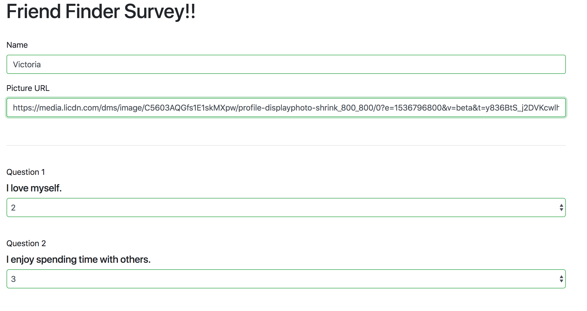

# FriendFinder

Friend Finder is a compatibility app designed to match friends together. This full-stack site takes in results from your users' surveys, then compares their answers with those from other users. The app then displays the name and picture of the user with the best overall match.

Friend Finder uses node and express to handle routing information between the client and server.

FriendFinder: https://mysterious-dusk-81552.herokuapp.com/